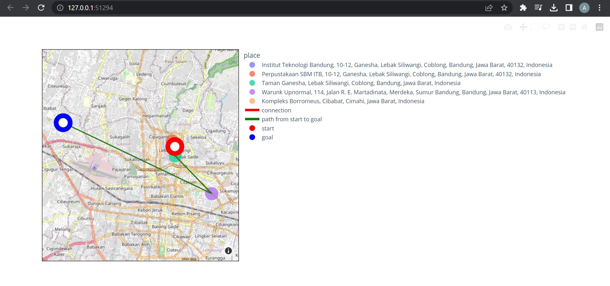

# Finding Most Optimal Path using UCS and A* Algorithm
Tugas Kecil 3 Mata Kuliah IF2211 Strategi Algoritma 2023 - Path Finder

## **Table of Contents**
* [General Information](#general-information)
* [Requirements](#requirements)
* [How to Run and Compile (Windows)](#how-to-run-and-compile-windows)
* [Screenshot](#screenshot)
* [Program Structure](#program-structure)
* [Authors](#authors)

## **General Information**
>Python program that finds the shortest path between two points on a map using two popular graph search algorithms - Uniform Cost Search (UCS) and A* Algorithm. The program takes a map as input, represented as a weighted graph, and applies the selected algorithm to find the shortest path from a source point to a destination point.

## **Requirements**
To use this program, you will need to install **Python3** (https://www.python.org/downloads/) on the device you are using. You will also need other libraries:
* Matplotlib Library
```sh
$ pip install matplotlib
```
* Networkx Library
```sh
$ pip install networkx
```
* Geopy Library
```sh
$ pip install geopy
```
* Plotly Library
```sh
$ pip install plotly
```
* Pandas Library
```sh
$ pip install pandas
```

## **How to Run and Compile (Windows)**
### **Setup**
1. Clone this repository <br>
```sh 
$ git clone https://github.com/melvinkj/Tucil3_13521052_13521100.git
```
2. Open this repository in terminal
### **Run**
1. Change the directory to the 'src' folder <br>
```sh 
$ cd src
```

2. Run program from CLI<br>
```sh 
$ python main.py
```

3. Run program from GUI<br>
```sh 
$ python gui.py
```

## **Screenshot**

1. Command Line Interface (CLI)
 
With Bonus
 
 
 
2. Graphical User Interface (GUI)
 
3. Bonus Map Visualizer
 


## **Program Structure**
```
.
┣ doc
 ┃ ┗ doc.txt
 ┣ src
 ┃ ┣ algorithm.py
 ┃ ┣ bonus.py
 ┃ ┣ gui.py
 ┃ ┣ main.py
 ┃ ┣ reader.py
 ┃ ┗ utils.py
 ┣ test
 ┃ ┣ alun_alun.txt
 ┃ ┣ ambon.txt
 ┃ ┣ buahbatu.txt
 ┃ ┣ itb.txt
 ┃ ┣ jakarta.txt
 ┃ ┣ tc1.txt
 ┃ ┗ tc2.txt
 ┗ README.md
```

## **Authors**

| **NIM**  |       **Name**        | **Class**  |       
| :------: | :-------------------: | :------:   | 
| 13521052 |    Melvin Kent Jonathan   | K02
| 13521100 |    Alexander Jason    | K02
